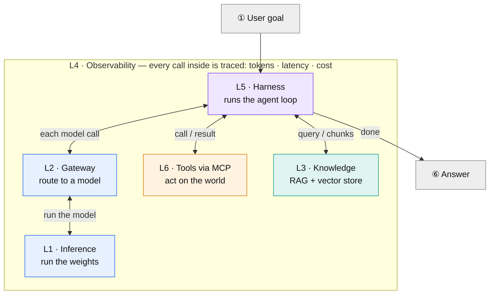
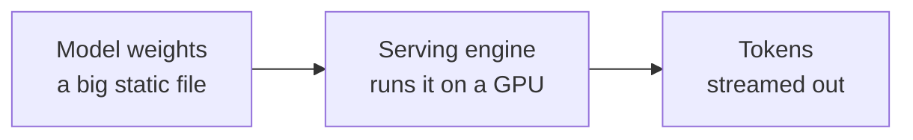
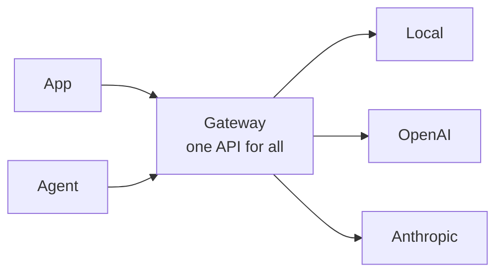
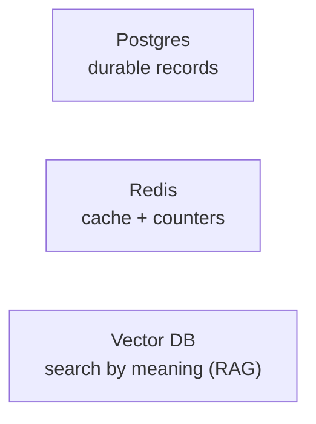
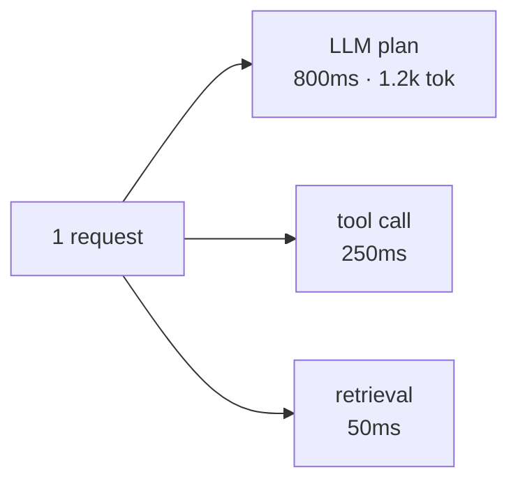
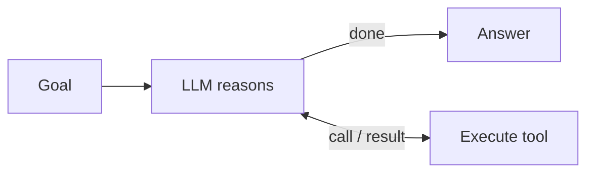
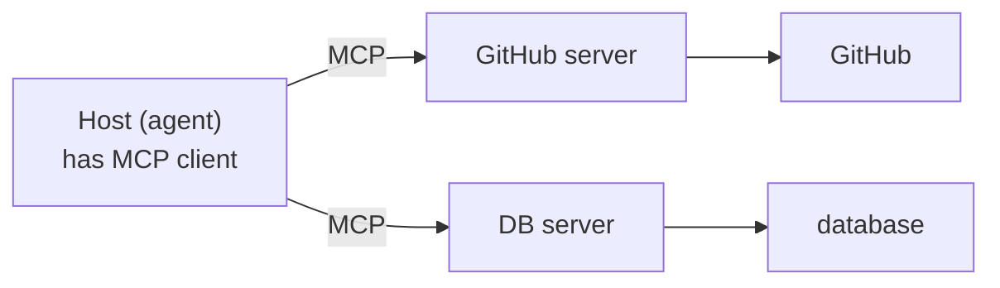

# The LLM Platform Stack — Learning Reference

A digestible map of the six layers of a modern LLM platform: how they connect, what each one is for, and example tools at each layer. Written for someone with a DevSecOps / platform-engineering background who is new to the AI-specific parts.

> **Note:** The diagrams below are written in [Mermaid](https://mermaid.js.org). They render automatically on GitHub, GitLab, Obsidian, and Typora. In VS Code you'll need a Mermaid preview extension.

---

## 1. The big picture — one request through all six layers

**How to read it:** Your goal enters the **harness (L5)**, which runs the loop. Every time the model needs to think, that call round-trips down through the **gateway (L2)** to the **inference engine (L1)** and back — that's what the double-headed arrows mean. During the loop the harness also reaches sideways: out to **tools over MCP (L6)** to *act*, and to the **vector store (L3)** to *retrieve* knowledge. The whole tree of calls is captured by **observability (L4)**, and when the model stops asking for tools, the harness returns the answer.

---

## 2. Examples at each layer

What technology sits at each layer — the version you'd run at home versus the production standard. A few tools (LiteLLM, Langfuse) are both.

| Layer | What it does | Home / open-source | Production standard |
|---|---|---|---|
| **L1 · Inference** | Runs the model weights, exposes an API | Ollama, llama.cpp, LM Studio | vLLM, cloud APIs (OpenAI / Anthropic / Z.ai), TGI, SGLang |
| **L2 · Gateway** | One unified API; routing, keys, cost, limits | LiteLLM, Portkey Gateway, Bifrost | LiteLLM, Portkey, Kong AI Gateway, Cloudflare / Bedrock / Vertex |
| **L3 · State & knowledge** | Durable records, cache, semantic search (RAG) | Postgres, Redis, pgvector, Chroma, Qdrant | Postgres, Redis; Pinecone, Weaviate, Milvus |
| **L4 · Observability** | Traces, token/cost logging, evals | Langfuse (self-host), Arize Phoenix, OpenLLMetry | Langfuse, LangSmith, Helicone, Datadog LLM |
| **L5 · Harness (agent loop)** | Orchestrates the model into doing work | opencode, Aider, Kilo Code; LangGraph, Pydantic AI | Codex, Claude Code, Cursor; LangGraph, CrewAI |
| **L6 · Interop (MCP)** | Standard way agents get tools + context | MCP servers (open standard); ACP, AGENTS.md | MCP (same open standard); A2A |

---

## 3. Layer by layer

### L1 · Inference — running the model

Runs the actual model: loads the multi-gigabyte weights file onto a GPU and turns requests into tokens. It exists because a model file does nothing by itself — something has to execute it efficiently, batching many requests together to keep the expensive GPU busy.

*Analogy:* the weights are a **container image** (a static artifact); the serving engine is the **runtime + app server** that runs it and handles concurrency. vLLM is your throughput-tuned production server; Ollama is `docker run` on your laptop.

### L2 · Gateway — one door in front of every model

One service in front of all your models. Apps talk only to it; it routes to whichever provider (local or cloud), holds the credentials centrally (apps get scoped **virtual keys** instead of the real secrets), and meters cost. It exists so you don't wire every app to every provider.

*Analogy:* an **API gateway / reverse proxy** — same single entry point, auth, routing, and rate limiting — plus two AI twists: it *translates* between provider dialects and its cost tracking is per-token.

### L3 · State & knowledge — memory, speed, and private data

Three stores for three different needs: **Postgres** (durable records — keys, budgets, spend logs), **Redis** (fast cache + rate-limit counters), and a **vector DB** (semantic search). The vector DB powers **RAG**: before answering, you retrieve relevant private/current text and feed it into the prompt, giving the frozen model knowledge it wasn't trained on.

*Analogy:* Postgres and Redis play the same roles they do everywhere. The vector DB is **full-text search upgraded from matching words to matching meaning** — it stores embeddings (numeric representations of meaning) and finds the nearest ones.

### L4 · Observability — seeing inside a fuzzy, costly system

Distributed tracing for LLM calls. One user request fans out into many **spans** (each model call, tool call, retrieval); this layer records the duration, tokens, and dollar cost of each, plus **evals** for measuring quality over time. It exists because the system is nondeterministic and every call costs real money.

*Analogy:* **Jaeger / Datadog APM** applied to model calls — trace = the request, spans = the operations — except each span also carries the prompt/response payload and its cost.

### L5 · Harness — the agent loop

Gives the model hands. The model can only *emit text*, so the harness runs a loop: the model asks for a tool, the harness executes it and feeds back the result, repeat until the model stops asking. It is also your **security chokepoint** — the model only *proposes* a tool call; the harness decides whether it actually runs.

*Analogy:* a **control loop** (like a Kubernetes reconciler) with the model as the "decide" step. Treat the model as **untrusted input** and the harness as the **Policy Enforcement Point** — allow-lists, sandboxes, and approvals live in the harness, never in the model.

### L6 · Interop — MCP, a universal socket for tools

Write one **MCP server** (GitHub, a database, your files) and any MCP-compatible harness can use it — no custom integration per tool. It turns an N×M integration mess (every tool rebuilt for every harness) into N + M.

*Analogy:* a **driver model** or **JDBC/ODBC** — one standard interface, many backends. Write the driver once; every host can use it.

---

## 4. Where to start (home build)

You don't need all six layers at once. The sensible starting subset is **L1 + L2 + L4**:

- **L1 — Ollama** (a local model to point things at)
- **L2 — LiteLLM** (your gateway, with one local model + one cloud key)
- **L4 — Langfuse** (so you can watch a single request light up across the trace view)

Once that clicks, layer on **L3** (pgvector for RAG) and **L6** (your first MCP server). Point **opencode (L5)** at your LiteLLM gateway, and everything you build maps onto a box in the master diagram:

| Layer | Home component |
|---|---|
| L1 · Inference | Ollama (later: vLLM) |
| L2 · Gateway | LiteLLM |
| L3 · State & knowledge | Postgres + Redis + pgvector |
| L4 · Observability | Langfuse |
| L5 · Harness | opencode |
| L6 · Interop | your MCP servers |

> **Security tip:** when you install LiteLLM, pin a known-clean version — two PyPI releases (1.82.7 and 1.82.8) shipped credential-stealing malware. Rotate any credentials that touched those versions.
